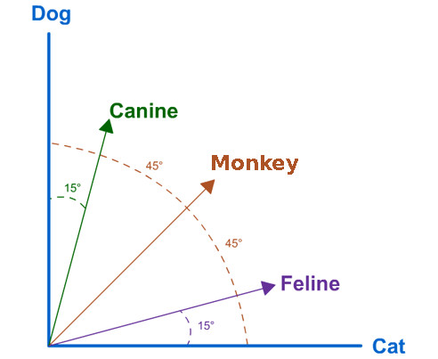

# search-engine

[](https://www.codacy.com/app/saraivaufc/search-engine?utm_source=github.com&amp;utm_medium=referral&amp;utm_content=saraivaufc/search-engine&amp;utm_campaign=Badge_Grade)



We designed and implemented a web search engine based on the vector space
 model. This search engine uses the non-relational database 
 [mongodb](https://www.mongodb.com) and the tookit of natural  language processing [nltk](https://www.nltk.org). 

### Dataset
**File**: data.csv

**Source**: https://dataverse.harvard.edu/dataset.xhtml?id=3010077

**Description**: This is a reusable publicly-available dataset for “media bias” studies. The content of this dataset is publish date, title, subtitle and text for 3824 news articles. These articles are collected by a project within 3 months from December of 2016 to march 2017. The source of these news articles are from ABC News, CNN news, The Huffington Post, BBC News, DW News, TASS News, Al Jazeera News, China Daily and RTE News. All of them are collected by using RSS feeds of each news sites. (2017-3-31)


### Install MongoDB

```shell
$ sudo apt-key adv --keyserver hkp://keyserver.ubuntu.com:80 --recv 68818C72E52529D4
$ sudo echo "deb http://repo.mongodb.org/apt/ubuntu bionic/mongodb-org/4.0 multiverse" | sudo tee /etc/apt/sources.list.d/mongodb-org-4.0.list
$ sudo apt-get update
$ sudo apt-get install -y mongodb-org
$ sudo systemctl start mongod
$ sudo systemctl enable mongod
```

### Create a database 
```shell
$ mongo
$ use search-engine
```
### Performing the ingestion of the articles in the database

```shell
$ python3 ingestion.py
```

### Run the search algorithm

```shell
$ python3 search.py
```

<a rel="license" href="http://creativecommons.org/licenses/by-nc/4.0/">
    
</a>
<br />
This work is licensed under a <a rel="license" href="http://creativecommons.org/licenses/by-nc/4.0/">Creative Commons Attribution-NonCommercial 4.0 International License</a>.
